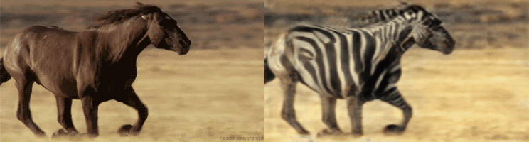

TCCCycleGAN by **Tensorflow 2.*! 

  

# 
 TCCCycleGAN - Tensorflow 2 

Tensorflow 2 implementation of TCCCycleGAN.

Paper: [Unpaired Image-to-Image Translation using Cycle-Consistent Adversarial Networks](https://arxiv.org/pdf/1703.10593.pdf)
Paper: [RecycleGAN](https://www.semanticscholar.org/paper/Unsupervised-video-to-video-translation-with-of-Liu-Li/e3ae2a3e7c30150817c2e3c8561eb60e49f26a25)

## Exemplar results

- Prerequisites

    - Tensorflow 2.0 `pip install tensorflow-gpu`
    - Tensorflow Addons `pip install tensorflow-addons`
    - (if you meet "tf.summary.histogram fails with TypeError" `pip install --upgrade tb-nightly`)
    - scikit-image, oyaml, tqdm
    - Python > 3.8
